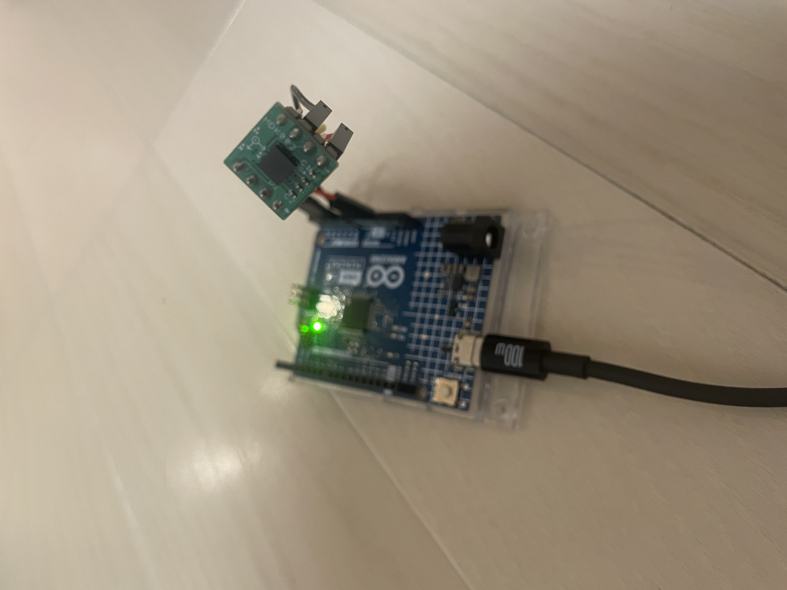
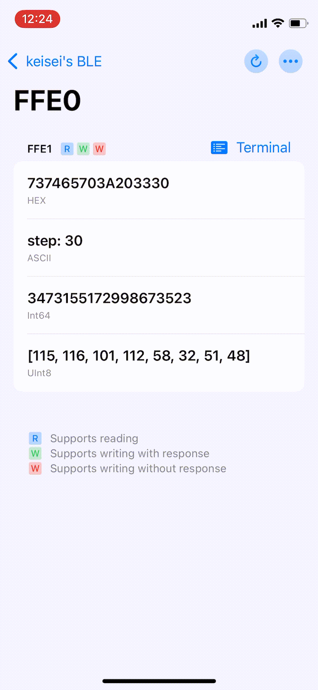

# step_counter🚶‍♂️‍➡️
Implementation of step counter.

## devices
- [Arduino UNO R4 MINIMA](https://docs.arduino.cc/hardware/uno-r4-minima/)
- [ADXL335](https://www.analog.com/en/products/adxl335.html)(3-Axis Accelerometer)
- AT-09 BLE Module

## implementation
I used [time domain analysis](https://www.analog.com/en/resources/app-notes/an-2554.html) as step counting algorithm method.

## reference
- https://www.analog.com/en/resources/app-notes/an-2554.html
- https://lastminuteengineers.com/adxl335-accelerometer-arduino-tutorial/
- https://docs.sunfounder.com/projects/umsk/en/latest/02_arduino/uno_lesson36_bluetooth.html
